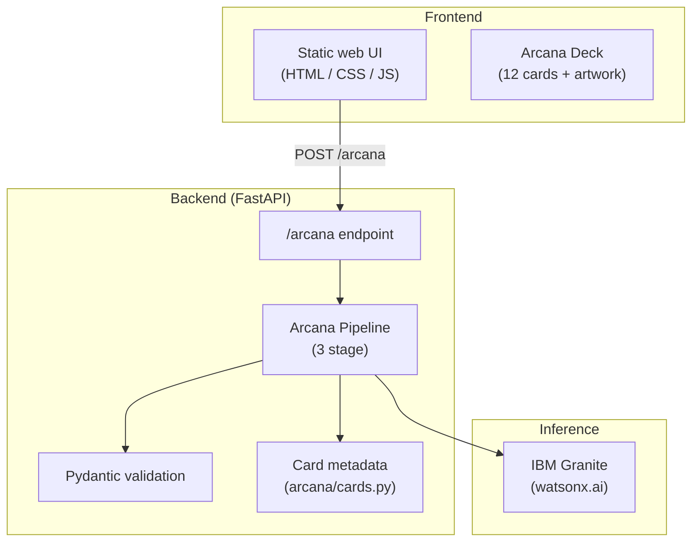

# Soccer Arcana

**Tactical enlightenment for the World Cup: explainable AI that turns match moments into Arcana readings.**

Soccer Arcana is an explainable AI experience built for global football fans. Describe any match moment (a nutmeg, a VAR call, a late collapse) and the system draws a symbolic card from a twelve card Arcana deck, then explains what happened in plain language: metaphor, tactics, culture, and emotion.

Built for the World Cup 2026 context, Soccer Arcana shows how IBM Granite on watsonx.ai can make complex football moments accessible to everyone watching the world's biggest tournament.

---

## Table of Contents

- [The Problem](#the-problem)
- [Why Soccer Arcana Matters](#why-soccer-arcana-matters)
- [Architecture](#architecture)
- [IBM Granite (watsonx.ai)](#ibm-granite-watsonxai)
- [The Arcana Pipeline](#the-arcana-pipeline)
- [The Deck](#the-deck)
- [Getting Started](#getting-started)
- [API Reference](#api-reference)
- [Project Structure](#project-structure)
- [License](#license)

---

## The Problem

Every four years, the World Cup turns casual observers into overnight fans. Billions watch matches they may never see again, but the *meaning* of what unfolds on the pitch often stays locked behind jargon, statistics, and insider knowledge.

### Why match moments are hard to understand

During a global event like the World Cup, new and casual fans face a steep learning curve:

- **Pace and density.** A single passage of play can contain pressing triggers, line breaks, offside traps, and tactical resets, all in ten seconds. Without context, it looks like random running.
- **Invisible structure.** Defensive collapses, momentum shifts, and counter attack setups are *systems* events. They are rarely explained on broadcast; commentators assume you already know what a high line is.
- **Cultural context is missing.** A nutmeg in Brazil, a soft penalty in England, and a backs to the wall clearance in Italy carry different emotional and cultural weight. Global audiences experience the same clip through different lenses.
- **Emotion without explanation.** Fans feel the shock of a late goal or the fury of a VAR decision, but cannot articulate *why* it mattered tactically or narratively.

### Why current tools fall short

Existing football tools tend to serve analysts, not audiences:

| Tool type | What it offers | Why it fails casual fans |
|-----------|----------------|--------------------------|
| **Stats dashboards** (xG, heat maps, pass networks) | Precise quantitative data | Requires literacy in expected goals, zones, and positional averages |
| **Tactical threads & blogs** | Deep analysis from experts | Written for enthusiasts; dense terminology; not in real time |
| **Highlight clips & social media** | Instant emotion | No explanation of *why* the moment happened or what it means |
| **Generic chatbots** | Natural language answers | Often hallucinate tactics; no structured, auditable reasoning |

Soccer Arcana fills this gap: **structured, explainable readings** that meet fans where they are, through story, symbol, and clear language, without dumbing down the football.

---

## Why Soccer Arcana Matters

### Metaphor + explainable AI

Football is already a language of metaphor. Fans speak of *collapses*, *sieges*, *ghosts in the box*, and *the twelfth man*. Soccer Arcana makes that instinct explicit through a twelve card **Major Arcana** deck, where each card is an archetype of the beautiful game.

Every reading is **explainable by design**:

1. **Classification:** the moment is categorized with a confidence score.
2. **Card selection:** a named card is chosen with a stated reason.
3. **Explanation:** four structured fields (metaphor, tactics, culture, emotion) ground the output in the specific moment.

Fans see not just *what* the AI said, but *how* it arrived there: card name, selection rationale, and layered interpretation. That transparency builds trust during a tournament where AI hype and misinformation both run high.

### Built for different kinds of fans

| Audience | How Soccer Arcana helps |
|----------|-------------------------|
| **New fans** | Plain language tactical explanations tied to a memorable card and metaphor, a hook to learn more |
| **Casual fans** | Cultural and emotional context that deepens enjoyment without requiring a coaching badge |
| **Global audiences** | Readings that acknowledge different football cultures (e.g. jogo bonito vs. catenaccio, viveza vs. fair play) |
| **Analysts & builders** | Structured JSON pipeline, schema validation, and stage level error reporting for inspection and iteration |

---

## Architecture

Soccer Arcana has three parts: a static web frontend, a FastAPI backend, and IBM Granite on watsonx.ai for inference. Card metadata in `arcana/cards.py` grounds each reading in predefined tactical, cultural, and emotional meanings.



### Components

| Component | Role | Location |
|-----------|------|----------|
| **Frontend** | Consult box, card reveal modal, full deck browser | `static/` |
| **Backend** | REST API, pipeline execution, error handling | `main.py`, `routes/`, `arcana/` |
| **Card metadata** | Archetypes with tactical, cultural, and emotional meanings | `arcana/cards.py`, `static/deck.js` |
| **Inference** | Classification, card selection, explanation generation | `granite_client.py` via watsonx.ai |

---

## IBM Granite (watsonx.ai)

Granite is the inference engine behind every reading. It runs the three stage Arcana pipeline: classify the moment, select the best card, and generate a structured explanation. Responses are constrained to JSON schemas so outputs are parseable, validatable, and inspectable.

- **Model:** `ibm/granite-3-8b-instruct` (configurable via `WATSONX_MODEL_ID`)
- **Client:** `granite_client.py` wraps the watsonx.ai SDK with tuned generation parameters (temperature, top k, max tokens) balanced for creative metaphor with reliable JSON.

### How a reading flows end to end

```
Fan describes moment
        │
        ▼
┌───────────────────┐
│  Frontend (UI)    │  "A winger nutmegs a defender in the 88th minute"
└─────────┬─────────┘
          │ POST /arcana
          ▼
┌───────────────────┐
│  FastAPI Backend  │
└─────────┬─────────┘
          │
          ▼
┌───────────────────┐
│  Card metadata    │  Deck definitions from arcana/cards.py
└─────────┬─────────┘
          │
          ▼
┌───────────────────┐
│ Granite Stage 1   │  Classify moment → { moment_type, confidence }
└─────────┬─────────┘
          ▼
┌───────────────────┐
│ Granite Stage 2   │  Select card → { card_name, reason }
└─────────┬─────────┘
          ▼
┌───────────────────┐
│ Granite Stage 3   │  Explain → { metaphor, tactical, cultural, emotional }
└─────────┬─────────┘
          │
          ▼
┌───────────────────┐
│  Pydantic validate│  Reject malformed JSON; surface stage errors
└─────────┬─────────┘
          │
          ▼
┌───────────────────┐
│  Card reveal UI   │  Artwork, reading, tactical / cultural / emotional panels
└───────────────────┘
```

---

## The Arcana Pipeline

The core pipeline in `arcana/pipeline.py` runs three sequential Granite calls:

| Stage | Input | Output | Purpose |
|-------|-------|--------|---------|
| **1. Classification** | Moment description + category list | `moment_type`, `confidence` | Map the moment to an Arcana archetype |
| **2. Card selection** | Classification + full deck metadata | `card_name`, `reason` | Choose the best fit card with explicit rationale |
| **3. Explanation** | Moment + selected card + card metadata | `metaphor`, `tactical_explanation`, `cultural_context`, `emotional_impact` | Generate the fan facing reading |

Each stage uses dedicated prompts in `arcana/prompts/` and validates Granite's JSON response against Pydantic models in `arcana/schema.py`. If Granite returns invalid JSON or an unknown card name, the API returns a structured error with the failing stage and raw model output for debugging.

---

## The Deck

Twelve Major Arcana cards, each with four dimensions of meaning:

| Card | Archetype | Example moment |
|------|-----------|----------------|
| **The Trickster** | Flair · Deception · The Unexpected | Nutmeg, feint, disguised pass |
| **The Tower** | Collapse · Exposure · Sudden Ruin | Defensive line broken, late collapse |
| **The Surge** | Pressure · Relentlessness · The Siege | Sustained pressing, wave attacks |
| **The Chaos Card** | Controversy · Fortune · The Twist | VAR call, scramble, deflection |
| **The Fortress** | Defiance · Resilience · The Last Line | Compact block, goalline clearance |
| **The Catalyst** | Spark · Ignition · The Turning Point | Decisive pass or shot that shifts momentum |
| **The Shadow** | Hidden Threat · Eclipse · The Unseen | Blind side run, poacher's timing |
| **The Sun** | Clarity · Triumph · The Shining Hour | Dominant spell, plan executed cleanly |
| **The Engine** | Tempo · Stamina · The Heartbeat | Box to box midfielder, tempo control |
| **The Mirror** | Symmetry · Rivalry · Reflection | Derby stalemate, mirrored shapes |
| **The Wave** | The Crowd · Momentum · The Twelfth Man | Home crowd surge, atmosphere shift |
| **The Anchor** | Anchor · Shield · The Holding Role | Pivot screens channels, kills counters |

Card metadata lives in `arcana/cards.py` (backend) and `static/deck.js` (frontend, including curated fallback readings). Artwork is in `static/cards/`.

---

## Getting Started

### Prerequisites

- Python 3.11+
- An [IBM watsonx.ai](https://www.ibm.com/watsonx) project with API access
- Environment variables for Granite inference

### Installation

```bash
git clone https://github.com/<your-org>/Soccer-Arcana.git
cd Soccer-Arcana
python -m venv .venv
source .venv/bin/activate   # Windows: .venv\Scripts\activate
pip install -r requirements.txt
```

### Configuration

Create a `.env` file (or export variables in your shell):

```bash
WATSONX_APIKEY=your_api_key
WATSONX_PROJECT_ID=your_project_id

# Optional overrides
WATSONX_URL=https://us-south.ml.cloud.ibm.com
WATSONX_MODEL_ID=ibm/granite-3-8b-instruct
```

Load them before starting the server, for example:

```bash
export $(grep -v '^#' .env | xargs)
```

### Run locally

```bash
uvicorn main:app --reload --port 8000
```

Open [http://localhost:8000](http://localhost:8000), describe a match moment, and click **Draw**.

### Run tests

```bash
pytest
```

Tests mock Granite responses so the pipeline can be verified without live API calls.

---

## API Reference

### `POST /arcana`

Primary endpoint for the fan experience.

**Request**

```json
{
  "moment_description": "A winger nutmegs a defender and breaks into space in the 88th minute."
}
```

**Response (success)**

```json
{
  "classification": {
    "moment_type": "The Trickster",
    "confidence": 0.91
  },
  "card": {
    "card_name": "The Trickster",
    "card_id": "trickster",
    "reason": "The nutmeg and flair align with trickster energy."
  },
  "explanation": {
    "metaphor": "A fox slips through the henhouse unnoticed.",
    "tactical_explanation": "A dribble in tight space broke the defensive line.",
    "cultural_context": "Street football culture celebrates humiliating defenders.",
    "emotional_impact": "Supporters gasp, then erupt in delight."
  }
}
```

**Response (pipeline error)**

```json
{
  "error": true,
  "stage": "classification",
  "message": "Invalid JSON in Granite response: ...",
  "raw_output": "..."
}
```

### Other endpoints

| Method | Path | Description |
|--------|------|-------------|
| `GET` | `/` | Serves the web UI |
| `GET` | `/test/arcana` | Runs the pipeline against a built in test moment |
| `POST` | `/granite` | Direct Granite prompt (debugging) |
| `POST` | `/interpret` | Legacy single shot interpretation |

Interactive API docs: [http://localhost:8000/docs](http://localhost:8000/docs)

---

## Project Structure

```
Soccer-Arcana/
├── main.py                 # FastAPI app entry point
├── app.py                  # ASGI app export
├── granite_client.py       # IBM Granite / watsonx.ai client
├── arcana/
│   ├── pipeline.py         # 3 stage Arcana pipeline
│   ├── cards.py            # Deck metadata (backend source of truth)
│   ├── schema.py           # Pydantic response models
│   ├── llm_engine.py       # Granite invocation wrapper
│   └── prompts/            # Stage specific prompt builders
├── routes/
│   ├── arcana_route.py     # POST /arcana
│   └── granite_route.py    # POST /granite
├── static/
│   ├── index.html          # Fan facing UI
│   ├── app.js              # Consult flow + card reveal
│   ├── deck.js             # Deck data + keyword matching (fallback)
│   ├── styles.css
│   └── cards/              # Card artwork (PNG)
└── tests/                  # Pipeline and prompt tests
```

---

## License

MIT License. See [LICENSE](LICENSE) for details.

---

<p align="center">
  <strong>Soccer Arcana · World Cup Edition</strong><br/>
  Wisdom through tactics: every match moment interpreted through the Arcana AI engine.
</p>
